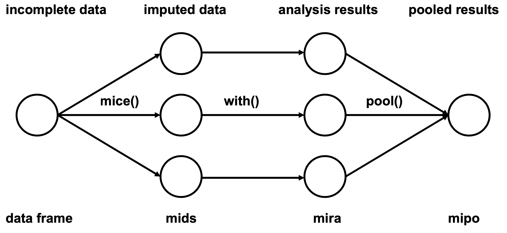
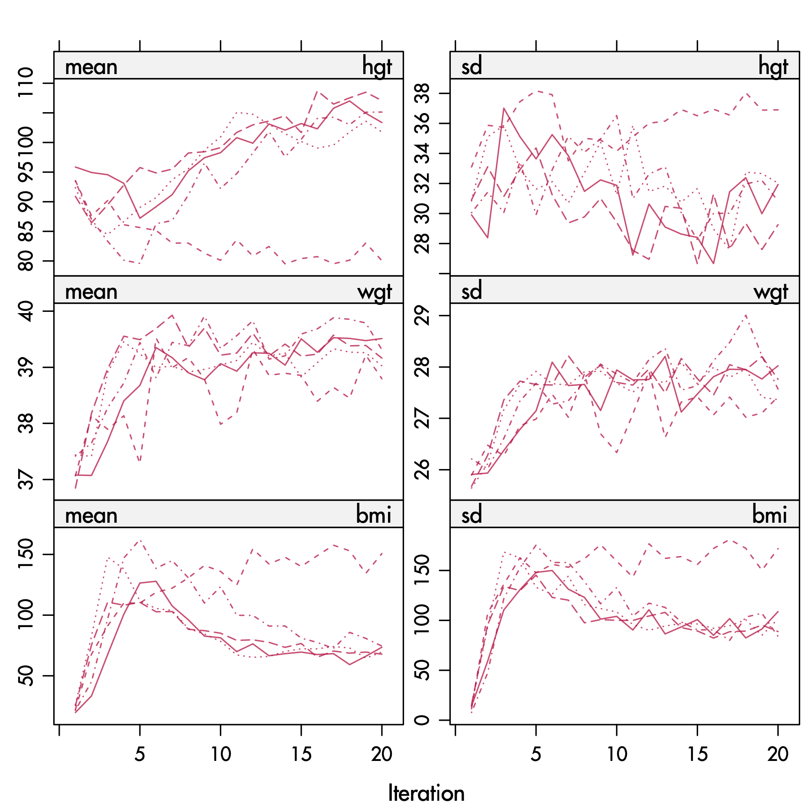
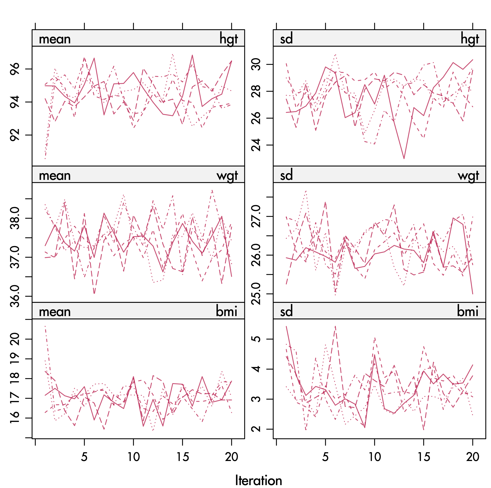

```{r include=FALSE}
setwd(path.expand("~/Project/impute/Presentaties/2019 Warsaw/Harmonization_Warsaw_2019/Lecture_1"))
RNGkind(sample.kind = "Rounding")
```


```{r setup, include=FALSE, results = 'hide'}
library("knitr")
knitr::opts_chunk$set(echo = FALSE)
options(knitr.kable.NA = '')
source("R/hooks.R")
# R scripts to load into .Rmd
knitr::read_chunk('R/fimd.R')
```

## Overview

- Missing data and harmonization
- Multiple imputation in a nutshell
- Alternatives for recoding
- Imputation of multilevel data

## Why this course

- Missing data are everywhere
- Harmonization is an attempt to solve a missing data problem
- Ad-hoc fixes do not (always) work
- Multiple imputation is broadly applicable, yield correct statistical inferences
- Goal of the course: introduce `mice` as a way to think about data harmonization

## Course materials

- URL to github site

- Materials: <https://www.asc.ohio-state.edu/dataharmonization/wp-content/uploads/2019/12/Workshop-Missing-Data-Imputation-Materials-Kotnarowski-2019-FINAL.pdf>

## Reading materials

- Van Buuren, S. and Groothuis-Oudshoorn, C.G.M. (2011). `mice`: Multivariate Imputation by Chained Equations in `R`. Journal of Statistical Software, 45(3), 1--67. <https://www.jstatsoft.org/article/view/v045i03>
- Van Buuren, S. (2018). Flexible Imputation of Missing Data. Second Edition. Chapman \& Hall/CRC, Boca Raton, FL. <https://stefvanbuuren.name/fimd>

## 

\centering{\includegraphics[height=9cm,keepaspectratio=true]{figures/cover_border.png}}

```{r fig.align="center", out.height=600, eval=FALSE}

```

## Today's schedule

Slot  | Time         | What | Topic
----- | ------------ | ---- | -------------------------
  A   | 10.00-11.30  |  L   | Multiple imputation intro
&nbsp;| 11.30-11.45  |&nbsp;| COFFEE/TEA
  B   | 11.45-13:15  |  L   | Imputation for harmonisation
&nbsp;| 13.15-14.30  |&nbsp;| LUNCH
  C   | 14.30-16.00  |  P   | Lab session: Kotnarowski, IFiS
&nbsp;| 13.15-14.30  |&nbsp;| COFFEE/TEA
  D   | 16.15-17.30  |  P   | Lab session: Kotnarowski, IFiS

## Definition of missing values

- Missing values are those values that are not observed
- Values do exist in theory, but we are unable to see them

## Some confusing terminology

- Complete data = Observed data + Unobserved data
- Incomplete data = Observed data
- Missing data = Unobserved data
- Complete cases = Subset of rows without missing values
- Complete variables = Subset of columns without missing values

## Complete data

```{r echo=FALSE, warning=FALSE, message=FALSE, out.height = '3in', fig.align='center'}
library(mice)
library(lattice)

### define data sets pattern1-pattern4 with four patterns

mdpat <- cbind(expand.grid(rec = 6:1, pat = 1:3, var = 1:3), 
               r = c(rep(c(1, 1, 0, 1, 1, 1), 3),
                     rep(c(1, 0, 0, 1, 1, 0), 3),
                     rep(c(1, 1, 0, 0, 1, 0), 3)))
mdpat[mdpat$pat==2 & mdpat$r==0, "r"] <- 2
mdpat[mdpat$pat==3 & mdpat$r==1, "r"] <- 2

### Figure 4.1
types <-  c("Complete", "Observed","Unobserved")
levelplot(r ~ var + rec | as.factor(pat), data = mdpat,
                  subset = pat == 1,
          as.table = TRUE, aspect = "iso",
          shrink = c(0.9), 
          col.regions = c(mdc(2:1)),
          colorkey = FALSE,
          region = TRUE,
          scales = list(draw = FALSE),
          xlab = "", ylab = "",
          between = list(x = 1, y = 0), strip = FALSE)
```

## Incomplete data = observed data

```{r, fig.align='center', out.height = '3in', }
levelplot(r ~ var + rec | as.factor(pat), data = mdpat,
                  subset = pat == 1,
          as.table = TRUE, aspect = "iso",
          shrink = c(0.9), 
          col.regions = c("grey90", mdc(1)),
          colorkey = FALSE,
          region = TRUE,
          scales = list(draw = FALSE),
          xlab = "", ylab = "",
          between = list(x = 1, y = 0),
          strip = FALSE)
```

## Missing data = unobserved data

```{r, fig.align='center', out.height = '3in', }
levelplot(r ~ var + rec | as.factor(pat), data = mdpat,
                  subset = pat == 1,
          as.table = TRUE, aspect = "iso",
          shrink = c(0.9), 
          col.regions = c(mdc(2), "grey90"),
          colorkey = FALSE,
          region = TRUE,
          scales = list(draw = FALSE),
          xlab = "", ylab = "",
          between = list(x = 1, y = 0),
          strip = FALSE)
```


## Why values can be missing

Missingness can occur for a lot of reasons. For example

- power failure, bad luck
- death, dropout, refusal
- routing, experimental design
- join, merge, bind
- different variables per source
- different number of categories per source

## Consequences of missing data

- Cannot calculate, not even the mean
- Less information than planned
- Enough statistical power?
- Different analyses, different $n$'s
- Systematic biases in the analysis
- Appropriate confidence interval, $P$-values?

Missing data can severely complicate interpretation and analysis

## Strategies to deal with missing data

- Prevention - impossible for ex-post analyses
- Weighting methods
- Likelihood methods, EM-algorithm
- Ad-hoc methods, e.g., single imputation, complete cases, recoding
- Multiple imputation

## Listwise deletion, complete-case analysis

- Analyze only the complete records
- Advantages
  + Simple (default in most software)
  + Unbiased under MCAR
  + Conservative standard errors, significance levels
  + Two special properties in regression

## Listwise deletion, complete-case analysis

- Disadvantages
  + Wasteful
  + May not be possible
  + Larger standard errors
  + Biased under MAR, even for simple statistics like the mean
  + Inconsistencies in reporting

## Mean imputation

```{r duo = TRUE, fig.width=4.5, fig.height=2.25}
source("R/mi.hist.R")

## ----load, eval = FALSE--------------------------------------------------
library("mice")

## ----meanimp, echo=TRUE--------------------------------------------------
imp <- mice(airquality, method = "mean", m = 1, maxit = 1, print = FALSE)

## ----plotmeanimp, duo = TRUE, echo=FALSE, fig.width=4.5, fig.height=2.25----
lwd <- 1
data <- complete(imp)
Yobs <- airquality[,"Ozone"]
Yimp <- data[,"Ozone"]
mi.hist(Yimp, Yobs,b=seq(-20,200,10),type="continuous",
        gray=F,lwd = lwd,
        obs.lwd=1.5, mis.lwd=1.5, imp.lwd=1.5,
        obs.col=mdc(4), mis.col=mdc(5), imp.col="transparent",
        mlt=0.08,main="",xlab="Ozone (ppb)",
        axes = FALSE)
box(lwd = 1)
plot(data[cci(imp),2:1],col=mdc(1), lwd=1.5,ylab="Ozone (ppb)",
     xlab="Solar Radiation (lang)",ylim=c(-10,170),
     axes = FALSE)
points(data[ici(imp),2:1],col=mdc(2),lwd=1.5)
axis(1, lwd = lwd)
axis(2, lwd = lwd, las = 1)
box(lwd = 1)
```

## Regression imputation

```{r duo = TRUE, fig.width=4.5, fig.height=2.25}
## ----regimp, echo=TRUE---------------------------------------------------
fit <- lm(Ozone ~ Solar.R, data = airquality)
pred <- predict(fit, newdata = ic(airquality))

## ----plotregimp, duo = TRUE, echo=FALSE, fig.width=4.5, fig.height=2.25----
lwd <- 1
Yobs <- airquality[,"Ozone"]
Yimp <- Yobs
Yimp[ici(airquality)] <- pred
ss <- cci(airquality$Solar.R)
data <- data.frame(Ozone=Yimp, Solar.R=airquality$Solar.R)
mi.hist(Yimp[ss], Yobs[ss],b=seq(-20,200,10),type="continuous",
        gray=F, lwd = lwd,
        obs.lwd=1.5, mis.lwd=1.5, imp.lwd=1.5,
        obs.col=mdc(4),mis.col=mdc(5), imp.col="transparent",
        mlt=0.08,main="",xlab="Ozone (ppb)", axes = FALSE)
box(lwd = 1)
plot(data[cci(imp),2:1],col=mdc(1),lwd=1.5,
     ylab="Ozone (ppb)", xlab="Solar Radiation (lang)",
     ylim=c(-10,170), axes = FALSE)
points(data[ici(imp),2:1],col=mdc(2),lwd=1.5)
axis(1, lwd = lwd)
axis(2, lwd = lwd, las = 1)
box(lwd = 1)
```

## Stochastic regression imputation

```{r duo = TRUE, fig.width=4.5, fig.height=2.25}
## ----sri-----------------------------------------------------------------
data <- airquality[, c("Ozone", "Solar.R")]
imp <- mice(data, method = "norm.nob", m = 1, maxit = 1,
            seed = 1, print = FALSE)

## ----plotsri, duo = TRUE, echo=FALSE, fig.width=4.5, fig.height=2.25-----
lwd <- 1
data <- complete(imp)
Yobs <- airquality[, "Ozone"]
Yimp <- data[, "Ozone"]
mi.hist(Yimp, Yobs,
        b = seq(-20, 200, 10), type = "continuous",
        gray = FALSE, lwd = lwd,
        obs.lwd = 1.5, mis.lwd = 1.5, imp.lwd = 1.5,
        obs.col = mdc(4),mis.col = mdc(5), imp.col = "transparent",
        mlt = 0.08, main = "", xlab = "Ozone (ppb)")
box(lwd = 1)
plot(data[cci(imp), 2:1], col = mdc(1),
     lwd = 1.5, ylab = "Ozone (ppb)",
     xlab = "Solar Radiation (lang)", ylim = c(-10, 170),
     axes = FALSE)
points(data[ici(imp), 2:1], col = mdc(2), lwd = 1.5)
axis(1, lwd = lwd)
axis(2, lwd = lwd, las = 1)
box(lwd = 1)
```

## Multiple imputation

\centering{\includegraphics[height=6cm,keepaspectratio=true]{figures/ch01-miflow-1.png}}


```{r fig.align="center", out.width=800, eval=FALSE}
knitr::include_graphics("figures/ch01-miflow-1.png")
```

## Acceptance of multiple imputation

```{r solo=TRUE, out.height="2in", fig.cap = "Source: Scopus (April 3, 2019)"}
## ----publications, echo=FALSE, fig.width=4.5, fig.height=2.25, solo=TRUE----
cit  <- c(     2018, 72, 442, NA,
               2017, 72, 434, NA,
               2016, 81, 360, NA,
               2015, 59, 327, NA,
               2014, 58, 290, NA,
               2013, 45, 230, NA,
               2012, 48, 216, NA,
               2011, 55, 181, NA,
               2010, 44, 156, NA,
               2009, 37, 111, NA,
               2008, 29, 104, NA,
               2007, 34, 113, NA,
               2006, 19, 75, NA,
               2005, 21, 63, NA,
               2004,  7, 44, NA,
               2003, 18, 37, NA,
               2002, 16, 37, NA,
               2001, 14, 35, 57,
               2000,  8, 19, 33,
               1999,  6, 18, 47,
               1998,  6, 12, 22,
               1997,  6, 16, 29,
               1996,  5, 12, 28,
               1995,  3, 5, 20,
               1994,  4, 6, 34,
               1993,  3, 6, 15,
               1992, NA, 4, NA,
               1991,  3, 4, 19,
               1990,  2, 3, 15,
               1989, NA, 2, 11,
               1988, NA, 1, 13,
               1987, NA, 3, 10,
               1986,  2, 3, 5,
               1985, NA, NA, 1,
               1984, NA, 1, 2,
               1983, NA, NA, 5,
               1982, NA, NA, 2,
               1981, NA, NA, 1,
               1980, NA, NA, 5,
               1979, NA, NA, 2,
               1978, NA, NA, 1,
               1977, NA, NA, 2)
cit <- matrix(cit, nr=2019-1977, nc=4, byrow=TRUE)
cit <- as.data.frame(cit)
names(cit) <- c("Year","Title","Abstract","All")
# par(cex = 0.7, lwd = 0.5)
plot(x = cit$Year, y = cit$Abstract, type="o",log="y",
     xlim = c(1975,2017), ylim = c(1,400),
     ylab="Number of publications (log)", xlab="Year",
     pch=24, bg = "white",
     axes=FALSE)
axis(1, at = seq(1977, 2017, 5), lwd = par("lwd"))
axis(2, lwd = par("lwd"), las=1)
lines(x=cit$Year, y=cit$Title, pch=15, type="o")
lines(x=cit$Year, y=cit$All, pch=16, type="o")
legend(x=1975,y=200,legend=c('early publications',
                            '"multiple imputation" in abstract',
                            '"multiple imputation" in title'),
       pch=c(16,2,15), bty="n")
```


## Pooled estimate $\bar Q$

$\hat Q_\ell$ is the estimate of the $\ell$-th repeated imputation

$\hat Q_\ell$ contains $k$ parameters, represented as a $k \times 1$ column vector

Pooled estimate $\bar Q$ is simply the average

$$ 
\bar Q = \frac{1}{m}\sum_{\ell=1}^m \hat Q_\ell
$$


## Within-imputation variance

Average of the complete-data variances as

$$
  \bar U = \frac{1}{m}\sum_{\ell=1}^m \bar U_\ell,
$$

where $\bar U_\ell$ is the variance-covariance matrix of
$\hat Q_\ell$ obtained for the $\ell$-th imputation

$\bar U_\ell$ is the variance is the estimate, *not* the
variance in the data

Within-imputation variance is large if the sample is small

## Between-imputation variance

Variance between the $m$ complete-data estimates is given by

$$
B = \frac{1}{m-1}\sum_{\ell=1}^m (\hat Q_\ell-\bar Q)(\hat Q_\ell-\bar Q)',
$$

where $\bar Q$ is the pooled estimate.
  
The between-imputation variance is large there many missing data

## Total variance

The total variance is *not* simply $T=\bar U + B$

The correct formula is

\begin{eqnarray}
  T & = & \bar U + B + B/m \nonumber \\
      & = & \bar U + \left(1+\frac{1}{m}\right)B
\end{eqnarray}


for the total variance of $\bar Q_m$, and hence of $(Q-\bar Q)$ if $\bar Q$
is unbiased

The term $B/m$ is the simulation error

## Three sources of variation

In summary, the total variance $T$ stems from three sources:

1. $\bar U$, the variance caused by the fact that we are taking a
    sample rather than the entire population. This is the
    conventional statistical measure of variability;
2. $B$, the extra variance caused by the fact that there are
    missing values in the sample;
3. $B/m$, the extra simulation variance caused by the fact that $\bar Q_m$
    itself is based on finite $m$.

## Variance ratio's (1)

Proportion of the variation attributable to the missing data

$$
  \lambda = \frac{B+B/m}{T}
$$

Relative increase in variance due to nonresponse

$$
  r = \frac{B+B/m}{\bar U}
$$

These are related by $r = \lambda/(1-\lambda)$.

## Variance ratio's (2)

Fraction of information about $Q$ missing due to nonresponse

$$
\gamma = \frac{r+2/(\nu+3)}{1+r}\label{eq:gammama}
$$

This measure needs an estimate of the degrees of freedom $\nu$ (c.f. section 2.3.6)

Relation between $\gamma$ and $\lambda$ 

$$
\gamma = \frac{\nu+1}{\nu+3}\lambda+\frac{2}{\nu+3}.\label{eq:gammamb}
$$

The literature often confuses $\gamma$ and $\lambda$.
  
## Statistical inference for $\bar Q$ (1)

The $100(1-\alpha)$\% confidence interval of a $\bar Q$ is calculated
as

$$
\bar Q \pm t_{(\nu,1-\alpha/2)}\sqrt{T},
$$

where $t_{(\nu,1-\alpha/2)}$ is the quantile corresponding to
probability $1-\alpha/2$ of $t_\nu$.

For example, use $t(10,0.975)=2.23$ for the 95\% confidence interval for $\nu=10$.

## Statistical inference for $\bar Q$ (2)

Suppose we test the null hypothesis $Q=Q_0$ for some
specified value $Q_0$. We can find the $P$-value of the test as the probability

$$
  P_s = \Pr\left[F_{1,\nu} > \frac{(Q_0 - \bar Q)^2}{T}\right]
$$

where $F_{1,\nu}$ is an $F$ distribution with 1 and $\nu$
degrees of freedom. 


## How large should $m$ be?

Classic advice: $m=3, 5, 10$. More recently: set $m$ higher: 20--100.

Some advice: 

- Use $m=5$ or $m=10$ if the fraction of missing information is low, $\gamma <0.2$.
- Develop your model with $m=5$. Do final run with $m$ equal to percentage of incomplete cases.


## Multiple imputation in `mice`

\centering{\includegraphics[height=8cm,keepaspectratio=true]{figures/figure1a.pdf}}


```{r fig.align="center", out.width=800, eval=FALSE}

```

## Inspect the data

```{r echo=TRUE}
library("mice")
head(nhanes)
```

## Inspect missing data pattern

```{r, echo=TRUE, out.height="3in", fig.align='center'}
md.pattern(nhanes)
```

## Multiply impute the data

```{r echo=TRUE}
imp <- mice(nhanes, print = FALSE, maxit=10, seed = 24415)
```

## Inspect the trace lines for convergence

```{r}
print(plot(imp))
```


## Stripplot of observed and imputed data

```{r echo=TRUE, eval=FALSE}
stripplot(imp, pch = 20, cex = 1.2)
```


## Stripplot of observed and imputed data

```{r}
print(stripplot(imp, pch = 20, cex = 1.2))
```


## Fit the complete-data model

```{r echo=TRUE}
fit <- with(imp, lm(bmi ~ age))
est <- pool(fit)
summary(est)
```

```{r}
library(mice)
library(MASS)
source("R/mice.impute.normdump.r")
source("R/mice.impute.pmmdump.r")
```


## Temperature and gas consumption

```{r gas_init}
data <- whiteside
lwd <- 1.5
```

```{r gas2, out.height="3in"}
plot(x=data$Temp, y=data$Gas, col=mdc(1), lwd=lwd, 
     xlab=expression(paste("Temperature (", degree, "C)")), 
     ylab="Gas consumption (cubic feet)")
```

## Delete gas consumption of day 47

```{r, out.height="3in"}
<<gas2>>
points(x=5, y=3.6, pch=4, cex=2, lwd=lwd, col=mdc(2))
legend(x="bottomleft", legend="deleted observation", pch=4, col=mdc(2), 
       pt.lwd=lwd, bty="n", pt.cex=2)
text(x=9, y=6.5, label="a",cex=2)
```

## Predict value from regression line

```{r, out.height="3in"}
<<gas2>>
data[47,"Gas"] <- NA
abline(m1<-lm(Gas~Temp, data=data, na.action=na.omit), col=mdc(1))
points(5,4.04, lwd=lwd, col=mdc(2),pch=19)
text(x=9, y=6.5, label="b",cex=2)
```

## Predict value + add noise

```{r, out.height="3in"}
<<gas2>>
imp <- mice(data, m=1, maxit=0)
pred <- imp$pred
pred["Gas","Insul"] <- 0
imp <- mice(data, m=5, pred=pred, meth="norm.nob", maxit=1, print=FALSE, seed=45433)
abline(m1<-lm(Gas~Temp, data=data, na.action=na.omit), col=mdc(1))
points(rep(5,5),imp$imp$Gas, lwd=lwd, col=mdc(2),pch=19)
text(x=9, y=6.5, label="c",cex=2)
```

## Predict + noise + parameter draw

```{r, out.height="3in"}
<<gas2>>
imp <- mice(data, m=1, maxit=0)
pred <- imp$pred
pred["Gas","Insul"] <- 0
betadump <- vector("list", 0) 
imp <- mice(data, m=5, pred=pred, meth="normdump", maxit=1, print=FALSE, seed=83126)
abline(m1<-lm(Gas~Temp, data=data, na.action=na.omit), col=mdc(1))
betadump <- matrix(betadump, nc=2, byrow=T)
for (i in 1:5) abline(coef=unlist(betadump[i,]), col=mdc(2))
points(rep(5,5),imp$imp$Gas, lwd=lwd, col=mdc(2),pch=19)
text(x=9, y=6.5, label="d",cex=2)
```

## Two predictors

```{r, out.height="3in"}
pch <- c(rep(3,26),rep(1,30))
plot(x=data$Temp, y=data$Gas, col=mdc(1), lwd=lwd, pch=pch, 
     xlab=expression(paste("Temperature (", degree, "C)")), 
     ylab="Gas consumption (cubic feet)")
imp <- mice(data, m=5, meth="norm", maxit=1, print=FALSE, seed=11727)
abline(m1<-lm(Gas~Temp, data=data, na.action=na.omit, subset=Insul=="Before"), col=mdc(4))
abline(m2<-lm(Gas~Temp, data=data, na.action=na.omit, subset=Insul=="After"), col=mdc(4))
points(rep(5,5),imp$imp$Gas, lwd=lwd, col=mdc(2),pch=19)
legend(x="bottomleft", legend=c("before insulation","after insulation"), pch=c(3,1),bty="n", pt.lwd=lwd)
text(x=9, y=6.5, label="e",cex=2)  
```

## Drawing from observed data

```{r, out.height="3in"}
pch <- c(rep(3,26),rep(1,30))
plot(x=data$Temp, y=data$Gas, col=mdc(1), lwd=lwd, pch=pch, 
     xlab=expression(paste("Temperature (", degree, "C)")), 
     ylab="Gas consumption (cubic feet)")
betadump <- vector("list", 0) 
imp <- mice(data, m=5, meth="pmmdump", maxit=1, print=FALSE, seed=68006)
betadump <- matrix(betadump, nc=3, byrow=T)
m1<-lm(Gas~Temp+Insul, data=data, na.action=na.omit)
an <- coef(m1)[1]
ai <- an + coef(m1)[3]
b <- coef(m1)[2]
abline(a=ai, b=b, col=mdc(1))
abline(a=an, b=b, col=mdc(1))
## for (i in 1:1) {
##   abline(a=unlist(betadump[i,1]), b=unlist(betadump[i,2]), col=mdc(5))
##   abline(a=unlist(betadump[i,1])+unlist(betadump[i,3]), b=unlist(betadump[i,2]), col=mdc(5))
## }
## points(rep(5,5),imp$imp$Gas, lwd=lwd, col=mdc(2), pch=20) 
delta <- 0.6
ylo <- ai+b*(5-delta)
yhi <- ai+b*(5+delta)
lines(x=c(5-delta,5+delta),y=c(ylo,yhi),lwd=3,col=mdc(1))
xlo <- (ylo-an)/b
xhi <- (yhi-an)/b
lines(x=c(xlo,xhi),y=c(ylo,yhi),lwd=3,col=mdc(1))

donors <- subset(data, (Insul=="After"&Temp>5-delta&Temp<5+delta) 
                 |    (Insul=="Before"&Temp>xlo&Temp<xhi))
points(x=donors$Temp, y=donors$Gas, cex=1.8, col=mdc(2), lwd=lwd)
legend(x="bottomleft", legend=c("before insulation","after insulation"), pch=c(3,1),bty="n", pt.lwd=lwd)
text(x=9, y=6.5, label="f",cex=2)
```

## Multivariate missing data


## Missing data patterns

```{r patterns}
```

## Three general strategies

- Monotone data imputation
- Joint modeling
- Fully conditional specification (FCS)

## Imputation of monotone pattern

```{r, fig.align='center', out.height="3in"}
data <- expand.grid(rec = 1:8, var = 1:4)
data$r <- c(rep(1, 8), rep(3, 2), rep(1, 6), rep(3, 4), rep(1, 4), rep(3, 5), rep(1, 3))
levelplot(r~var+rec, data=data,
            as.table=FALSE, aspect="iso",
            shrink=c(0.9),
            col.regions = c(mdc(1), mdc(2), "grey90"), 
            cuts = 2,
            colorkey=FALSE,
            scales=list(draw=FALSE),
            xlab="", ylab="",
            between = list(x=1,y=0),
            strip = strip.custom(bg = "grey95", style = 1,
                                 factor.levels = types))
```

## Imputation of monotone pattern

```{r, fig.align='center', out.height="3in"}
data <- expand.grid(rec = 1:8, var = 1:4)
data$r <- c(rep(1, 8), rep(2, 2), rep(1, 6), rep(3, 4), rep(1, 4), rep(3, 5), rep(1, 3))
levelplot(r~var+rec, data=data,
            as.table=FALSE, aspect="iso",
            shrink=c(0.9),
            col.regions = c(mdc(1), mdc(2), "grey90"), 
            cuts = 2,
            colorkey=FALSE,
            scales=list(draw=FALSE),
            xlab="", ylab="",
            between = list(x=1,y=0),
            strip = strip.custom(bg = "grey95", style = 1,
                                 factor.levels = types))
```

## Imputation of monotone pattern

```{r, fig.align='center', out.height="3in"}
data <- expand.grid(rec = 1:8, var = 1:4)
data$r <- c(rep(1, 8), rep(2, 2), rep(1, 6), rep(2, 4), rep(1, 4), rep(3, 5), rep(1, 3))
levelplot(r~var+rec, data=data,
            as.table=FALSE, aspect="iso",
            shrink=c(0.9),
            col.regions = c(mdc(1), mdc(2), "grey90"), 
            cuts = 2,
            colorkey=FALSE,
            scales=list(draw=FALSE),
            xlab="", ylab="",
            between = list(x=1,y=0),
            strip = strip.custom(bg = "grey95", style = 1,
                                 factor.levels = types))
```

## Imputation of monotone pattern

```{r, fig.align='center', out.height="3in"}
data <- expand.grid(rec = 1:8, var = 1:4)
data$r <- c(rep(1, 8), rep(2, 2), rep(1, 6), rep(2, 4), rep(1, 4), rep(2, 5), rep(1, 3))
levelplot(r~var+rec, data=data,
            as.table=FALSE, aspect="iso",
            shrink=c(0.9),
            col.regions = c(mdc(1), mdc(2)), 
            cuts = 1,
            colorkey=FALSE,
            scales=list(draw=FALSE),
            xlab="", ylab="",
            between = list(x=1,y=0),
            strip = strip.custom(bg = "grey95", style = 1,
                                 factor.levels = types))
```

## Imputation by joint modelling

```{r, fig.align='center', out.height="3in"}
data <- expand.grid(rec = 1:8, var = 1:3)
data$r <- c(rep(3, 2), rep(1, 6), rep(3, 3), rep(1, 5), rep(1, 3), rep(3, 5))
levelplot(r~var+rec, data=data,
            as.table=FALSE, aspect="iso",
            shrink=c(0.9),
            col.regions = c(mdc(1), mdc(2), "grey90"), 
            cuts = 2,
            colorkey=FALSE,
            scales=list(draw=FALSE),
            xlab="", ylab="",
            between = list(x=1,y=0),
            strip = strip.custom(bg = "grey95", style = 1,
                                 factor.levels = types))
```

## Imputation by joint modelling

```{r, fig.align='center', out.height="3in"}
data <- expand.grid(rec = 1:8, var = 1:3)
data$r <- c(rep(3, 2), rep(1, 6), rep(3, 3), rep(1, 5), rep(1, 3), rep(2, 5))
levelplot(r~var+rec, data=data,
            as.table=FALSE, aspect="iso",
            shrink=c(0.9),
            col.regions = c(mdc(1), mdc(2), "grey90"), 
            cuts = 2,
            colorkey=FALSE,
            scales=list(draw=FALSE),
            xlab="", ylab="",
            between = list(x=1,y=0),
            strip = strip.custom(bg = "grey95", style = 1,
                                 factor.levels = types))
```

## Imputation by joint modelling

```{r, fig.align='center', out.height="3in"}
data <- expand.grid(rec = 1:8, var = 1:3)
data$r <- c(rep(3, 2), rep(1, 6), rep(3, 2), 2, rep(1, 5), rep(1, 3), rep(2, 5))
levelplot(r~var+rec, data=data,
            as.table=FALSE, aspect="iso",
            shrink=c(0.9),
            col.regions = c(mdc(1), mdc(2), "grey90"), 
            cuts = 2,
            colorkey=FALSE,
            scales=list(draw=FALSE),
            xlab="", ylab="",
            between = list(x=1,y=0),
            strip = strip.custom(bg = "grey95", style = 1,
                                 factor.levels = types))
```

## Imputation by joint modelling

```{r, fig.align='center', out.height="3in"}
data <- expand.grid(rec = 1:8, var = 1:3)
data$r <- c(rep(2, 2), rep(1, 6), rep(2, 2), 2, rep(1, 5), rep(1, 3), rep(2, 5))
levelplot(r~var+rec, data=data,
            as.table=FALSE, aspect="iso",
            shrink=c(0.9),
            col.regions = c(mdc(1), mdc(2)), 
            cuts = 1,
            colorkey=FALSE,
            scales=list(draw=FALSE),
            xlab="", ylab="",
            between = list(x=1,y=0),
            strip = strip.custom(bg = "grey95", style = 1,
                                 factor.levels = types))
```

## Joint modelling - next iteration

```{r, fig.align='center', out.height="3in"}
data <- expand.grid(rec = 1:8, var = 1:3)
data$r <- c(rep(4, 2), rep(1, 6), rep(4, 3), rep(1, 5), rep(1, 3), rep(4, 5))
levelplot(r~var+rec, data=data,
            as.table=FALSE, aspect="iso",
            shrink=c(0.9),
            col.regions = c(mdc(1), mdc(2), "grey90", hcl(0, 100, 40, 0.3)), 
            cuts = 2,
            colorkey=FALSE,
            scales=list(draw=FALSE),
            xlab="", ylab="",
            between = list(x=1,y=0),
            strip = strip.custom(bg = "grey95", style = 1,
                                 factor.levels = types))
```

## Joint modelling - next iteration

```{r, fig.align='center', out.height="3in"}
data <- expand.grid(rec = 1:8, var = 1:3)
data$r <- c(rep(4, 2), rep(1, 6), rep(4, 3), rep(1, 5), rep(1, 3), rep(2, 5))
levelplot(r~var+rec, data=data,
            as.table=FALSE, aspect="iso",
            shrink=c(0.9),
            col.regions = c(mdc(1), mdc(2), "grey90", hcl(0, 100, 40, 0.3)), 
            cuts = 2,
            colorkey=FALSE,
            scales=list(draw=FALSE),
            xlab="", ylab="",
            between = list(x=1,y=0),
            strip = strip.custom(bg = "grey95", style = 1,
                                 factor.levels = types))
```

## Fully conditional specification

```{r, fig.align='center', out.height="3in"}
data <- expand.grid(rec = 1:8, var = 1:3)
data$r <- c(rep(3, 2), rep(1, 6), rep(3, 3), rep(1, 5), rep(1, 3), rep(3, 5))
levelplot(r~var+rec, data=data,
            as.table=FALSE, aspect="iso",
            shrink=c(0.9),
            col.regions = c(mdc(1), mdc(2), "grey90"), 
            cuts = 2,
            colorkey=FALSE,
            scales=list(draw=FALSE),
            xlab="", ylab="",
            between = list(x=1,y=0),
            strip = strip.custom(bg = "grey95", style = 1,
                                 factor.levels = types))
```


## Fully conditional specification

```{r, fig.align='center', out.height="3in"}
data <- expand.grid(rec = 1:8, var = 1:3)
data$r <- c(rep(4, 2), rep(1, 6), rep(4, 3), rep(1, 5), rep(1, 3), rep(4, 5))
levelplot(r~var+rec, data=data,
            as.table=FALSE, aspect="iso",
            shrink=c(0.9),
            col.regions = c(mdc(1), mdc(2), "grey90", hcl(0, 100, 40, 0.3)), 
            cuts = 2,
            colorkey=FALSE,
            scales=list(draw=FALSE),
            xlab="", ylab="",
            between = list(x=1,y=0),
            strip = strip.custom(bg = "grey95", style = 1,
                                 factor.levels = types))
```

## Fully conditional specification

```{r, fig.align='center', out.height="3in"}
data <- expand.grid(rec = 1:8, var = 1:3)
data$r <- c(rep(2, 2), rep(1, 6), rep(4, 3), rep(1, 5), rep(1, 3), rep(4, 5))
levelplot(r~var+rec, data=data,
            as.table=FALSE, aspect="iso",
            shrink=c(0.9),
            col.regions = c(mdc(1), mdc(2), "grey90", hcl(0, 100, 40, 0.3)), 
            cuts = 2,
            colorkey=FALSE,
            scales=list(draw=FALSE),
            xlab="", ylab="",
            between = list(x=1,y=0),
            strip = strip.custom(bg = "grey95", style = 1,
                                 factor.levels = types))
```

## Fully conditional specification

```{r, fig.align='center', out.height="3in"}
data <- expand.grid(rec = 1:8, var = 1:3)
data$r <- c(rep(2, 2), rep(1, 6), rep(2, 3), rep(1, 5), rep(1, 3), rep(4, 5))
levelplot(r~var+rec, data=data,
            as.table=FALSE, aspect="iso",
            shrink=c(0.9),
            col.regions = c(mdc(1), mdc(2), "grey90", hcl(0, 100, 40, 0.3)), 
            cuts = 2,
            colorkey=FALSE,
            scales=list(draw=FALSE),
            xlab="", ylab="",
            between = list(x=1,y=0),
            strip = strip.custom(bg = "grey95", style = 1,
                                 factor.levels = types))
```

## Fully conditional specification

```{r, fig.align='center', out.height="3in"}
data <- expand.grid(rec = 1:8, var = 1:3)
data$r <- c(rep(2, 2), rep(1, 6), rep(2, 3), rep(1, 5), rep(1, 3), rep(2, 5))
levelplot(r~var+rec, data=data,
            as.table=FALSE, aspect="iso",
            shrink=c(0.9),
            col.regions = c(mdc(1), mdc(2)), 
            cuts = 1,
            colorkey=FALSE,
            scales=list(draw=FALSE),
            xlab="", ylab="",
            between = list(x=1,y=0),
            strip = strip.custom(bg = "grey95", style = 1,
                                 factor.levels = types))
```

## Fully conditional specification - next

```{r, fig.align='center', out.height="3in"}
data <- expand.grid(rec = 1:8, var = 1:3)
data$r <- c(rep(4, 2), rep(1, 6), rep(4, 3), rep(1, 5), rep(1, 3), rep(4, 5))
levelplot(r~var+rec, data=data,
            as.table=FALSE, aspect="iso",
            shrink=c(0.9),
            col.regions = c(mdc(1), mdc(2), "grey90", hcl(0, 100, 40, 0.3)), 
            cuts = 2,
            colorkey=FALSE,
            scales=list(draw=FALSE),
            xlab="", ylab="",
            between = list(x=1,y=0),
            strip = strip.custom(bg = "grey95", style = 1,
                                 factor.levels = types))
```

## Fully conditional specification - next

```{r, fig.align='center', out.height="3in"}
data <- expand.grid(rec = 1:8, var = 1:3)
data$r <- c(rep(2, 2), rep(1, 6), rep(4, 3), rep(1, 5), rep(1, 3), rep(4, 5))
levelplot(r~var+rec, data=data,
            as.table=FALSE, aspect="iso",
            shrink=c(0.9),
            col.regions = c(mdc(1), mdc(2), "grey90", hcl(0, 100, 40, 0.3)), 
            cuts = 2,
            colorkey=FALSE,
            scales=list(draw=FALSE),
            xlab="", ylab="",
            between = list(x=1,y=0),
            strip = strip.custom(bg = "grey95", style = 1,
                                 factor.levels = types))
```

## How many iterations?

- Quick convergence
- 5--10 iterations is adequate for most problems
- More iterations is $\lambda$ is high
- Inspect the generated imputations
- Monitor convergence to detect anomalies

## Non-convergence

  \centering{\includegraphics[height=8cm,keepaspectratio=true]{figures/ch5-convergence3}}

```{r fig.align='center', out.height=520, eval=FALSE}

```

## Convergence

  \centering{\includegraphics[height=8cm,keepaspectratio=true]{figures/ch5-convergence5}}

```{r fig.align='center', out.height=520, eval=FALSE}

```

## Conclusion

- A general problem, a general solution
- `mice` package: >50,000 downloads per month
- Highly useful for data combination
