## Two problems in combining datasets


```{r include=FALSE}
# setwd(path.expand("~/Project/impute/Presentaties/2019 Warsaw/Harmonization_Warsaw_2019/Lecture_2"))
RNGkind(sample.kind = "Rounding")
```


```{r setup, include=FALSE, results = 'hide'}
library("knitr")
knitr::opts_chunk$set(echo = FALSE)
options(knitr.kable.NA = '')
source("R/hooks.R")
# R scripts to load into .Rmd
knitr::read_chunk('R/fimd.R')
```

1. Different number of categories
2. Uncollected variables

## 1. Different number of categories

## Trust in government
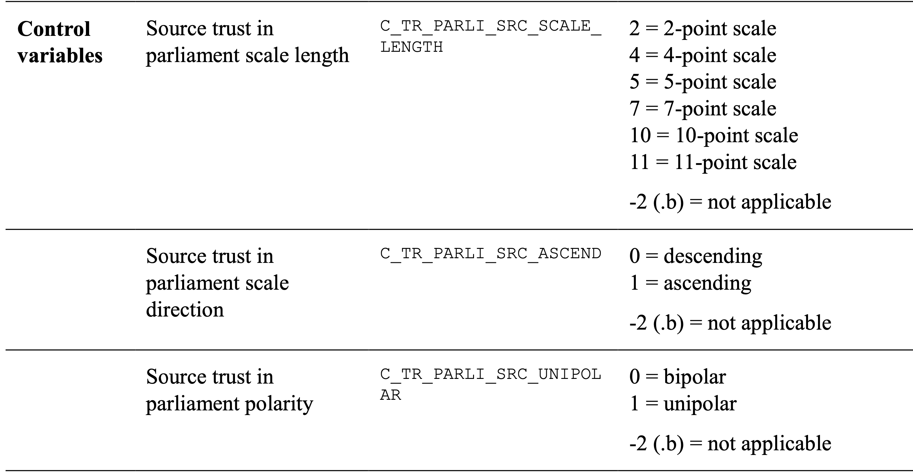
```{r fig.align='center', out.width=800, eval=FALSE}

```

## Method 1: Stretch to finer scale
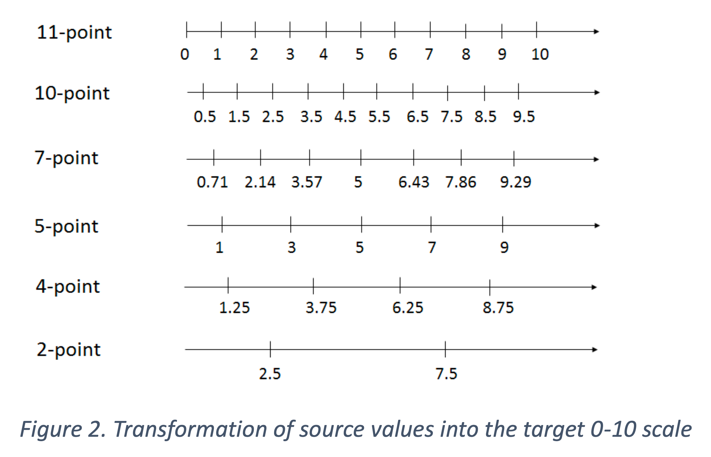

```{r fig.align='center', out.height=520, eval=FALSE}

```

## Method 2: Align ranges
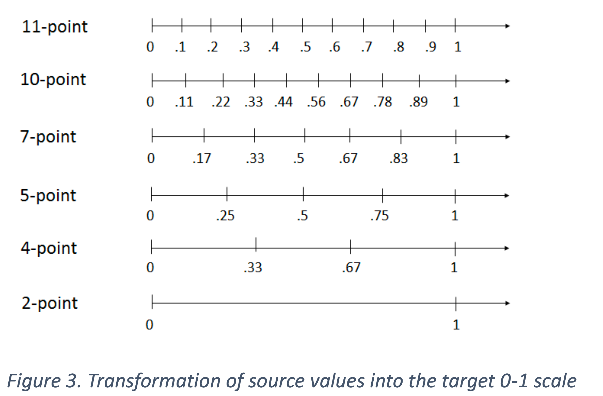

```{r fig.align='center', out.height=520, eval=FALSE}

```

## Method 3: Cohortwise transform to uniform
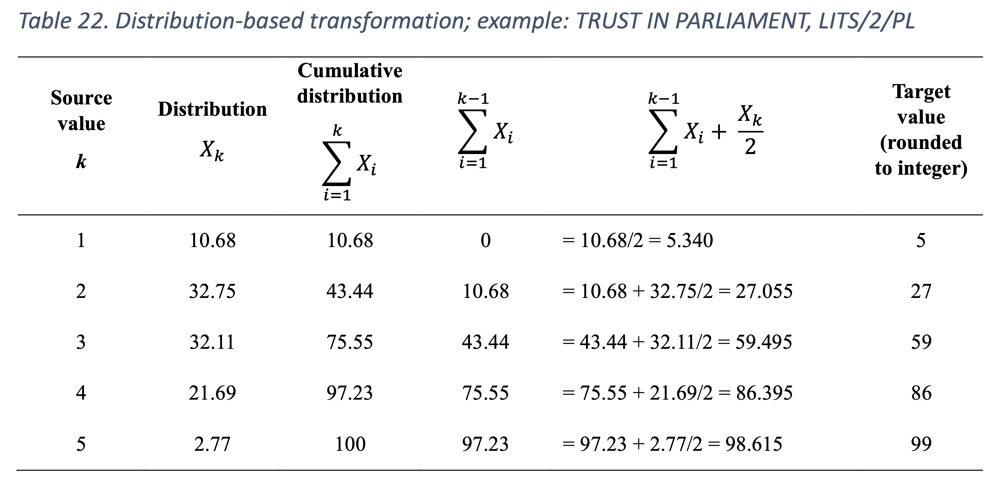

```{r fig.align='center', out.width=800, eval=FALSE}

```

## 1 vs 2

```{r include=FALSE, eval=FALSE}
fn <- path.expand("~/Project/impute/presentaties/2019 Warsaw/Harmonization_Warsaw_2019/data/SDR_Master_File_1_0-1.RData")
load(fn)
set.seed(12344)
z <- x[sample(1:nrow(x), size = 100000), ]
library(ggplot2)
theme_set(theme_light())
ggplot2::ggplot(subset(z, subset = T_TR_PARLI_11 >= 0), 
                  aes(x = T_TR_PARLI_N, y = T_TR_PARLI_11, colour = factor(C_TR_PARLI_SRC_SCALE_LENGTH))) +
                  geom_line()
                  geom_point(alpha = 1) + 
                  scale_colour_brewer(palette = "Set1")
ggplot2::ggplot(subset(z, subset = T_TR_PARLI_11 >= 0), 
                  aes(x = T_TR_PARLI_DISTRIB, y = T_TR_PARLI_11, colour = factor(C_TR_PARLI_SRC_SCALE_LENGTH))) +
                  geom_point(alpha = 1) + 
                  scale_colour_brewer(palette = "Set1")
```

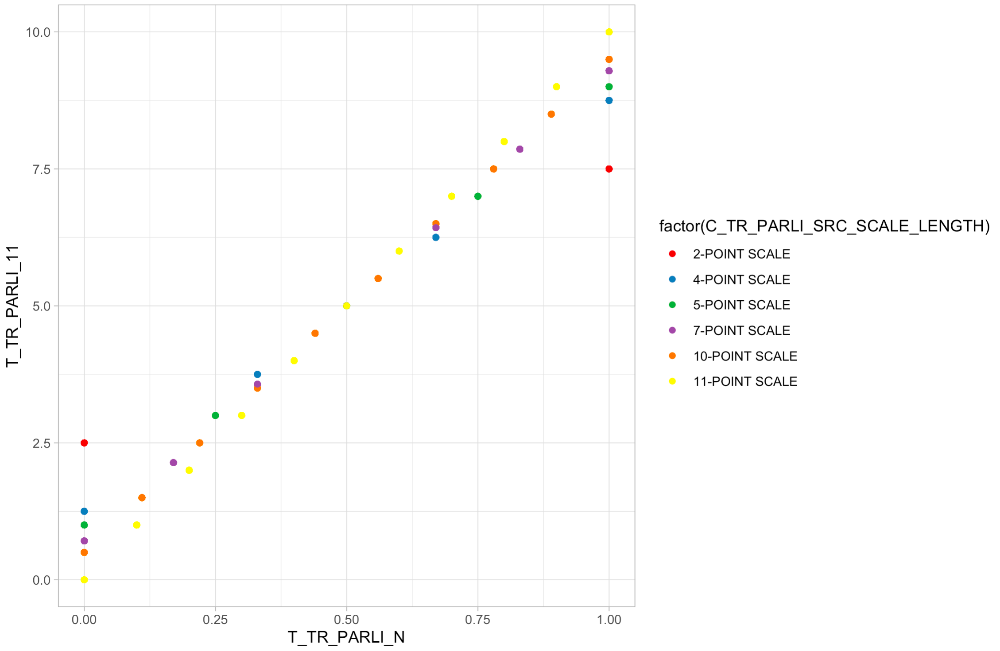

```{r fig.align='center', out.width=800, eval=FALSE}

```

## 1 vs 3
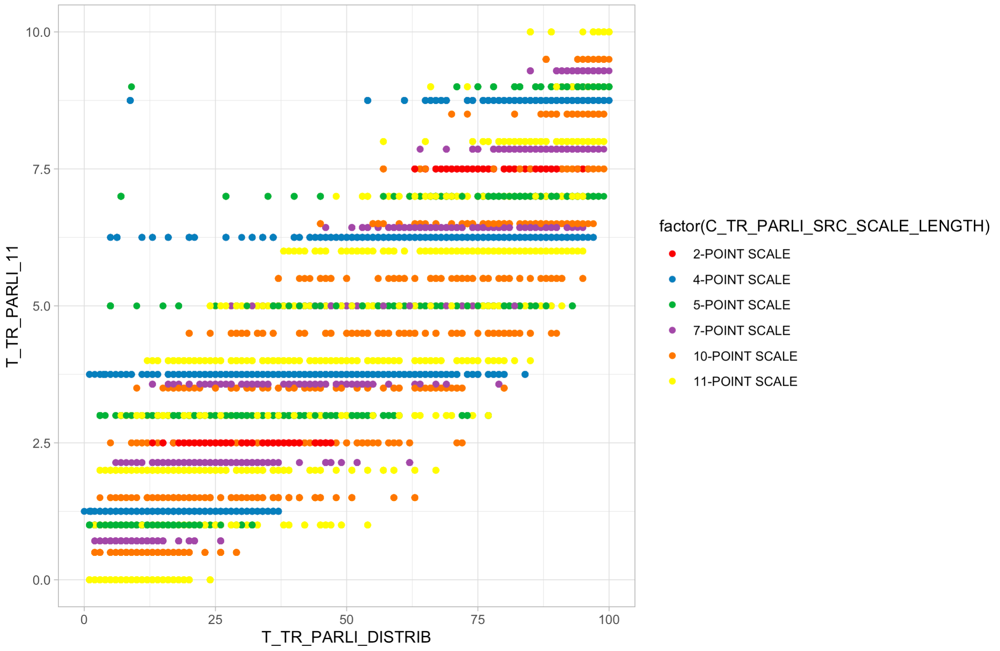

```{r fig.align='center', out.width=800, eval=FALSE}

```

## Comments

- Untested assumptions
  - 1/2: equal distance between categories
  - 3: same percentile distribution over cohorts
- Arbitrary, not obvious which to choose
- Does not account for response behaviors
- Impact on conclusions


## Levels of equivalence

1. **construct inequivalence**: no equivalent concepts across cohorts
2. **construct equivalence**: same concept is measured, but scales differ
3. **procedural equivalence**: common procedure to measure objects, but there is no underlying unit or ordering in the numbers
4. **unit equivalence**: same units but different anchors
5. **scalar equivalence**: same ratio scale across cohort

## Idea

- Generalize transformation one --> many
- Learn relations from the data

## Crisp coding
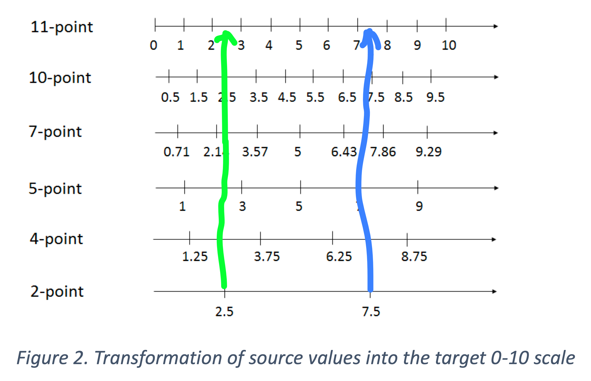

```{r fig.align='center', out.width=800, eval=FALSE}

```

## Fuzzy coding
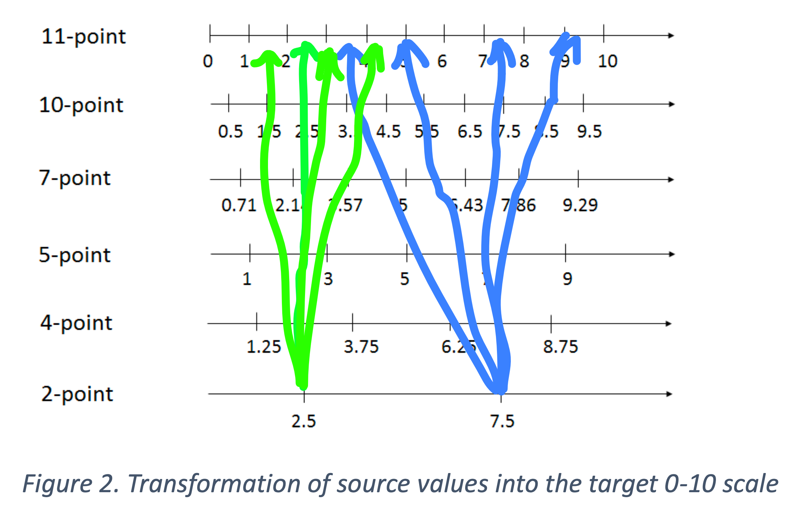

```{r fig.align='center', out.width=800, eval=FALSE}

```

## Trust parlement: 0-10 scale, 0-1 scale {.smaller}

| 0-10 |  no | yes |   no |  yes |
| ----:| ---:| ---:| ----:| ----:|
| 0    |   3 |   0 |  .02 |  .00 |
| 1    |   0 |   0 |  .00 |  .00 |
| 2    |   6 |   1 |  .05 |  .01 |
| 3    |  10 |   0 |  .08 |  .00 |
| 4    |  12 |   1 |  .09 |  .01 |
| 5    |  30 |   8 |  .24 |  .05 |
| 6    |  32 |  12 |  .25 |  .07 |
| 7    |  25 |  54 |  .20 |  .33 |
| 8    |   8 |  44 |  .06 |  .27 |
| 9    |   0 |  33 |  .00 |  .20 | 
| 10   |   1 |   8 |  .01 |  .05 |
|      |     |     |      |      |
|      | 127 | 161 | 1.00 | 1.00 |


## Example: Walking disability in two countries

- Uses the `walking` data in `mice`


## Item `HAQ8` measured in Antonia

**Are you able to walk outdoors on flat ground?**

| Cat | Label                      | Count |
| ---:|:-------------------------- | -----:|
|   0 | Without any difficulty     |   242 |
|   1 | With some difficulty       |    43 |
|   2 | With much difficulty       |    15 |
|   3 | Unable to do               |     0 |
|  NA | Missing                    |     6 |
|     |                            |       |
|     | Total                      |   306 |

Antonia statistic (Mean disability): $(242 \times 0+43 \times 1+15 \times 2)/ 300 = 0.243$


## Item `GARS9` measured in Belmark

**Can you, fully independently, walk outdoors (if necessary with a cane)?**

| Cat | Label                      | Count |
| ---:|:-------------------------- | -----:|
|   0 | Yes, no difficulty         |   145 |
|   1 | Yes, with some difficulty  |   110 |
|   2 | Yes, with much difficulty  |    29 |
|   3 | No, only with help from others | 8 |
|  NA | Missing                    |     0 |
|     |                            |       |
|     | Total                      |   292 |

Belmark statistic: proportion no difficulty (PND): 145/292 = 0.50

## Problem

- We want to compare walking problems between Antonia and Belmark
- What to do?

## The easy way: Equate all categories

| Country    | *Mean*|*PND* |
|:---------- | -----:| ----:|
| Antonia    |   .24 |  .80 |
| Belmark    |   .66 |  .50 | 
|            |       |      |
| Difference |  -.42 |  .30 |

- Both *Mean* and *PND* indicate more walking problems in Belmark
- Differences are large
- Assumes that we can perfectly map *HAQ8* into *GARS9*, and vice versa. 
- That is, the correlation is 1.0: Is that realistic?

## A third country: Citrus

|                 | *GARS9 *  |       |    |    |  |      |
|:----------------|----------:|------:|---:|---:|--|-----:|
|*HAQ8*           |          0|     1 |   2|   3|  | Total|
|                 |           |       |    |    |  |      |
|0                |        256|    90 |   6|   4|  |   356|
|1                |         26|    90 |  20|   0|  |   136|
|2                |          6|    40 |  28|  10|  |    84|
|3                |          0|     0 |   2|   2|  |     4|
|NA               |          2|     0 |   2|   0|  |     4|
|                 |           |       |    |    |  |      |
|Total            |        290|   220 |  58|  16|  |   584|

- Not symmetric: *HAQ8* appears more difficult than *GARS9*
- Kendall's $\tau = 0.57$, not 1.00
- Are there consequences for the comparison?

## How to impute: data structure
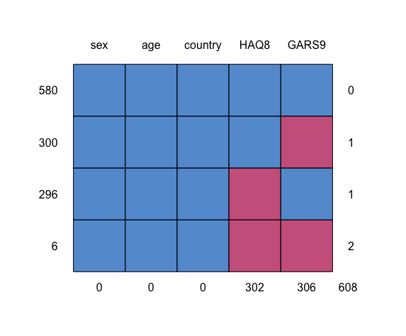

```{r results='hide', eval=FALSE}
suppressPackageStartupMessages(library(mice, quietly = TRUE))
x <- walking
x <- rbind(x, x[x$src == "E",])
levels(x$src) <- c("Antonia", "Belmark", "Citrus")
names(x) <- c("sex", "age", "HAQ8", "GARS9", "country")
oldpar <- par(mar = c(3,1,1,1))
md.pattern(x)
par(oldpar)
```

## How to impute: Kendall's $\tau$ for imputed HAQ8 and GARS9

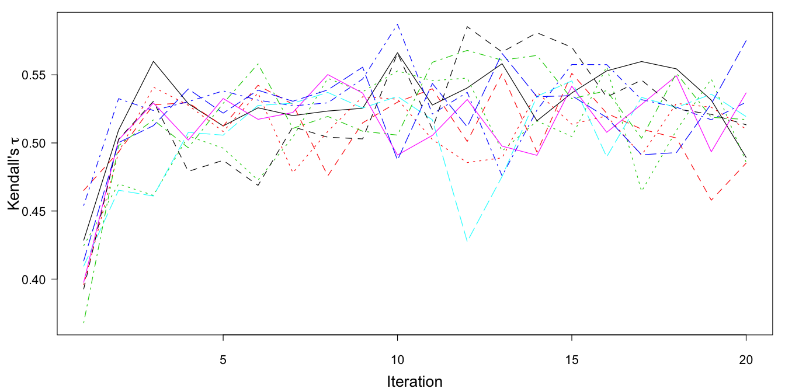

## Result: Proportion No difficulty (*PND*) in Antonia

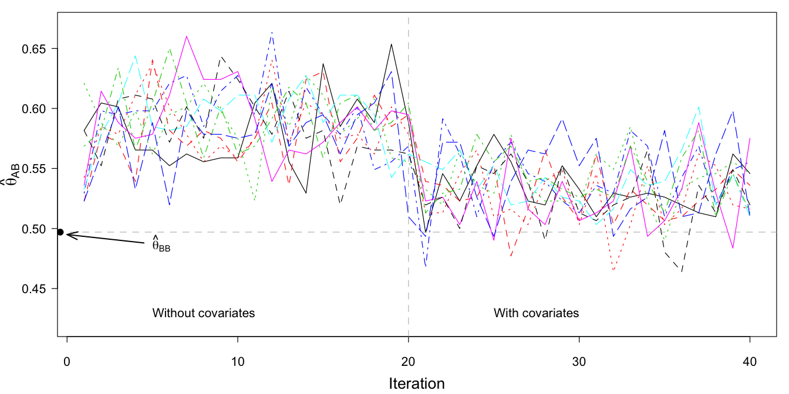

## Results: equating <--> MI <--> MI + age + sex

| Country    | *Mean*|*PND* |   | *Mean*|*PND* |   | *Mean*|*PND* |
|:---------- | -----:| ----:| -:| -----:| ----:| -:| -----:| ----:|
| Antonia    |   .24 |  .80 |   |   .24 |  .59 |   |   .24 | .53  |
| Belmark    |   .66 |  .50 |   |   .45 |  .50 |   |   .45 | .50  |
|            |       |      |   |       |      |   |       |      |
| Difference |  -.42 |  .30 |   |  -.22 |  .09 |   |  -.22 | .03  |

- Antonia is still doing better, but the effects are much smaller
- Correction has more effect on "proportion of no difficulty" (*PND*) (10 times smaller!)

## Conclusions

- **Simple equating exaggerates differences between countries**, e.g., +30 percent points instead of +3 percent points
- Overstated differences may spur inappropriate interventions, sometimes with substantial financial consequences
- Worse problems exist for the different number of categories, popular *crisp recoding*
- Advised remedy: multiple imputation, including covariates

- More detail: <https://stefvanbuuren.name/fimd/sec-codingsystems.html>
- Code: <https://github.com/stefvanbuuren/fimdbook/blob/master/R/fimd.R>

## 2. Uncollected variables

```{r setup2, include=FALSE, results = 'hide'}
library("knitr")
library("dplyr", warn.conflicts = FALSE)
suppressMessages(library("mice", warn.conflicts = FALSE))
suppressMessages(library("miceadds", warn.conflicts = FALSE))
knitr::opts_chunk$set(echo = FALSE)
options(knitr.kable.NA = '')
knitr::read_chunk('R/fimd.R')
```

Analysis of individual patient data (IPD) is very popular. 
It has many advantages over meta-analysis of aggregate data, e.g.,

- Consistent inclusion/exclusion criteria
- Missing data can be treated at the patient level
- Verifies original analysis
- Removal of duplicate subjects
- Consistent correction for confounders

## Problem: Studies collect different variables

Missing data in IPD

- **Systematically missing**: Not collected, missing for all in study
- **Sporadically missing**: Collected, but missing for some in study

- Can be at level-1 or level-2 of the analysis

## Imputation of IPD data

- In general, we need multilevel imputation models
- Historically, most techniques were suited only for sporadically missing
- Wish to preserve between-study heterogeneity in errors: `mice::mice.impute.2l.norm()`
- More recently, two types of models, level-1:
  - generalization to systematically missing: `mice::mice.impute.2l.lmer()` (Jolani, 2016)
  - 2-stage models: `micemd::mice.impute.2l.2stage.norm()` (Resche-Rigon 2016)

## `brandsma` data

- Brandsma and Knuver, Int J Ed Res, 1989.
- Extensively discussed in Snijders and Bosker (2012), 2nd ed.
- 4106 pupils, 216 schools, about 4% missing values

```{r echo=TRUE}
library(mice)
head(brandsma[, c(1:6, 9:10, 13)], 3)
```


## `brandsma` data subset

```{r cache=TRUE, echo=TRUE}
d <- brandsma[, c("sch", "lpo", "sex", "den")]
head(d, 2)
```

- `sch`: School number, cluster variable, $C = 216$;
- `lpo`: Language test post, outcome at pupil level;
- `sex`: Sex of pupil, predictor at pupil level (0-1);
- `den`: School denomination, predictor at school level (1-4).

## Model of scientific interest
 
Predict `lpo` from the

- level-1 predictor `sex` 
- level-2 predictor `den`

## Level notation - Bryk and Raudenbush (1992)

\begin{align}
{{\texttt{lpo}}}_{ic} & = \beta_{0c} + \beta_{1c}{{\texttt{sex}}}_{ic} + \epsilon_{ic}\\
\beta_{0c}     & = \gamma_{00} + \gamma_{01}{{\texttt{den}}}_{c} + u_{0c}\\
\beta_{1c}     & = \gamma_{10}
\end{align}

- $\text{lpo}_{ic}$ is the test score of pupil $i$ in school $c$
- $\text{sex}_{ic}$ is the sex of pupil $i$ in school $c$
- $\text{den}_c$ is the religious denomination of school $c$
- $\beta_{0c}$ is a random intercept that varies by cluster
- $\beta_{1c}$ is a sex effect, assumed to be the same across schools.
- $\epsilon_{ic} \sim N(0, \sigma_\epsilon^2)$ is the within-cluster random residual at the pupil level

## Level 2 equations: interpretation

The first level-2 model 
$$\beta_{0c} = \gamma_{00} + \gamma_{01}\text{den}_c + u_{0c}, $$
describes the variation in the mean test score between schools as a function of 

- the grand mean $\gamma_{00}$,
- a school-level effect $\gamma_{01}$ of denomination, and a 
- school-level random residual $u_{0c}\sim N(0, \sigma_{u_0}^2)$

The second level 2 model 
$$\beta_{1c} = \gamma_{10},$$
specifies $\beta_{1c}$ as a fixed effect equal in value to $\gamma_{10}$

## Unknown parameters

\begin{align}
{{\texttt{lpo}}}_{ic} & = \beta_{0c} + \beta_{1c}{{\texttt{sex}}}_{ic} + \epsilon_{ic}\\
\beta_{0c}     & = \gamma_{00} + \gamma_{01}{{\texttt{den}}}_{c} + u_{0c}\\
\beta_{1c}     & = \gamma_{10}
\end{align}

The unknowns to be estimated are the fixed parameters: 

- $\gamma_{00}$, 
- $\gamma_{01}$, and 
- $\gamma_{10},$

and the variance components:

- $\sigma_\epsilon^2$ and
- $\sigma_{u_0}^2.$

## Where are the missings?

In single level data, missingness may be in the outcome and/or in the predictors

With multilevel data, missingness may be in:

1. the outcome variable;

2. the level-1 predictors;

3. the level-2 predictors;

4. the class variable.

## Univariate missing, level-1 outcome

```{r, fig.align='center', out.height="3in"}
data <- expand.grid(rec = 1:8, var = 1:3)
data$r <- c(c(2, 1, 1), c(1, 1), c(2, 2, 1), 
            rep(1, 16))
levelplot(r~var+rec, data=data,
            as.table=FALSE, aspect="iso",
            shrink=c(0.9),
            col.regions = c(mdc(1), mdc(2)), 
            cuts = 1,
            colorkey=FALSE,
            scales = list(y = list(at = 1:8, labels = c(rep(3,3), rep(2,2), rep(1, 3)), tck = 0, cex = 2),
                          x = list(at = 1:3, labels = c("lpo", "sex", "den"), alt = 2, tck = 0, cex = 2)),
            xlab="", ylab="",
            between = list(x=10,y=0), strip = FALSE)
```

## Univariate missing, level-1 predictor, sporadically missing

```{r, fig.align='center', out.height="3in"}
data <- expand.grid(rec = 1:8, var = 1:3)
data$r <- c(rep(1, 8), 
            c(1, 1, 2), c(1, 1), c(1, 2, 1), 
            rep(1, 8))
levelplot(r~var+rec, data=data,
            as.table=FALSE, aspect="iso",
            shrink=c(0.9),
            col.regions = c(mdc(1), mdc(2)), 
            cuts = 1,
            colorkey=FALSE,
            scales = list(y = list(at = 1:8, labels = c(rep(3,3), rep(2,2), rep(1, 3)), tck = 0, cex = 2),
                          x = list(at = 1:3, labels = c("lpo", "sex", "den"), alt = 2, tck = 0, cex = 2)),
            xlab="", ylab="",
            between = list(x=10,y=0), strip = FALSE)
```

## Univariate missing, level-1 predictor, systematically missing

```{r, fig.align='center', out.height="3in"}
data <- expand.grid(rec = 1:8, var = 1:3)
data$r <- c(rep(1, 8), 
            c(1, 1, 2), c(1, 1), c(2, 2, 2), 
            rep(1, 8))
levelplot(r~var+rec, data=data,
            as.table=FALSE, aspect="iso",
            shrink=c(0.9),
            col.regions = c(mdc(1), mdc(2)), 
            cuts = 1,
            colorkey=FALSE,
            scales = list(y = list(at = 1:8, labels = c(rep(3,3), rep(2,2), rep(1, 3)), tck = 0, cex = 2),
                          x = list(at = 1:3, labels = c("lpo", "sex", "den"), alt = 2, tck = 0, cex = 2)),
            xlab="", ylab="",
            between = list(x=10,y=0), strip = FALSE)
```


## Univariate missing, level-2 predictor

```{r, fig.align='center', out.height="3in"}
data <- expand.grid(rec = 1:8, var = 1:3)
data$r <- c(rep(1, 16), 
            c(1, 1, 1, 2, 2, 2, 2, 2))
levelplot(r~var+rec, data=data,
            as.table=FALSE, aspect="iso",
            shrink=c(0.9),
            col.regions = c(mdc(1), mdc(2)), 
            cuts = 1,
            colorkey=FALSE,
            scales = list(y = list(at = 1:8, labels = c(rep(3,3), rep(2,2), rep(1, 3)), tck = 0, cex = 2),
                          x = list(at = 1:3, labels = c("lpo", "sex", "den"), alt = 2, tck = 0), cex = 2),
            xlab="", ylab="",
            between = list(x=10,y=0), strip = FALSE)
```


## Multivariate missing

```{r, fig.align='center', out.height="3in"}
data <- expand.grid(rec = 1:8, var = 1:3)
data$r <- c(c(2, 1, 1), c(1, 1), c(2, 2, 1),
            c(1, 1, 2), c(1, 1), c(1, 2, 1), 
            c(1, 1, 1, 2, 2, 2, 2, 2))
levelplot(r~var+rec, data=data,
            as.table=FALSE, aspect="iso",
            shrink=c(0.9),
            col.regions = c(mdc(1), mdc(2)), 
            cuts = 1,
            colorkey=FALSE,
            scales = list(y = list(at = 1:8, labels = c(rep(3,3), rep(2,2), rep(1, 3)), tck = 0, cex = 2),
                          x = list(at = 1:3, labels = c("lpo", "sex", "den"), alt = 2, tck = 0), cex = 2),
            xlab="", ylab="",
            between = list(x=10,y=0), strip = FALSE)
```


## Nine challenges in multilevel imputation (1 of 3)

1. For small clusters the within-cluster mean and variance are unreliable estimates, so the choice of the prior distribution becomes critical.

2. For a small number of clusters, it is difficult to estimate the between-cluster variance of the random effects.

3. In applications with systematically missing data, there are no observed values in the cluster, so the cluster location cannot be estimated.

## Nine challenges in multilevel imputation  (2 of 3)

4. The variation of the random slopes can be large, and some methods have difficulty handling this.

5. The error variance $\sigma_\epsilon^2$ may differ across clusters (heteroscedasticity), whereas the standard model assumes equal error variances.

6. The residual error distributions can be far from normal, e.g., for categorical data.

## Nine challenges in multilevel imputation (3 of 3)

7. The model may contain aggregates of the level-1 variables, such as cluster means, which need to be taken in account during imputation.

8. The model may contain interactions, or other nonlinear terms.

9. It may not be possible to fit the multilevel model, or there are convergence problems.

See [Van Buuren (2018)](https://stefvanbuuren.name/fimd/sec-missmult.html)

## Ad hoc solutions

1. Listwise deletion: Generally not recommended
2. Single-level imputation: Biases ICC downwards. 

- Conducting multiple imputation with the wrong model (e.g., single-level methods) can be more hazardous than listwise deletion.

3. Include dummy per cluster: Fixed effects generally unbiased, but the random effects are not. Biases ICC upwards.

## Three general strategies

- Monotone data imputation
- Joint modeling
- Fully conditional specification (FCS)


## Fully conditional specification

\begin{align}
\dot{{\texttt{lpo}}}_{ic} & \sim N(\beta_0 + \beta_1 {{\texttt{den}}}_{c} + \beta_2 {{\texttt{sex}}}_{ic} + u_{0c}, \sigma_\epsilon^2)\\
\dot{{\texttt{sex}}}_{ic} & \sim N(\beta_0 + \beta_1 {{\texttt{den}}}_{c} + \beta_2 {{\texttt{lpo}}}_{ic} + u_{0c}, \sigma_\epsilon^2)
\end{align}

## Theoretical problem with FCS

Conditional expectation of $\texttt{sex}_{ic}$ in a random effects model depends on

- $\texttt{lpo}_{ic}$,
- $\overline{\texttt{lpo}}_{i}$, the mean of cluster $i$, and
- $n_i$, the size of cluster $i$.

Resche-Rigon & White (2018) suggest the imputation model 

- should incorporate the cluster means of level-1 predictors 
- be heteroscedastic if cluster sizes vary


## Methods for multilevel imputation in `mice`
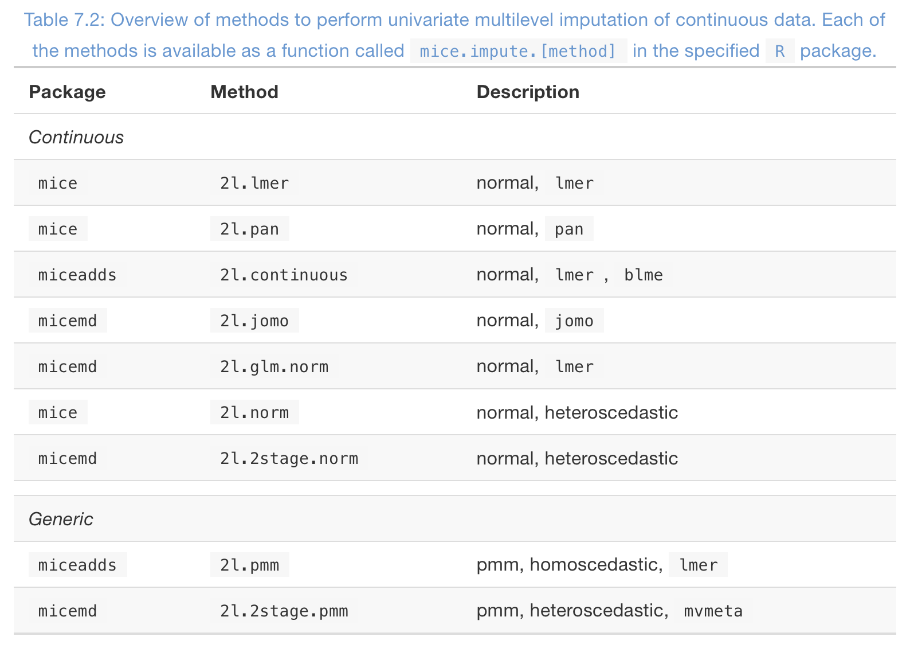

## Methods for multilevel imputation in `mice`
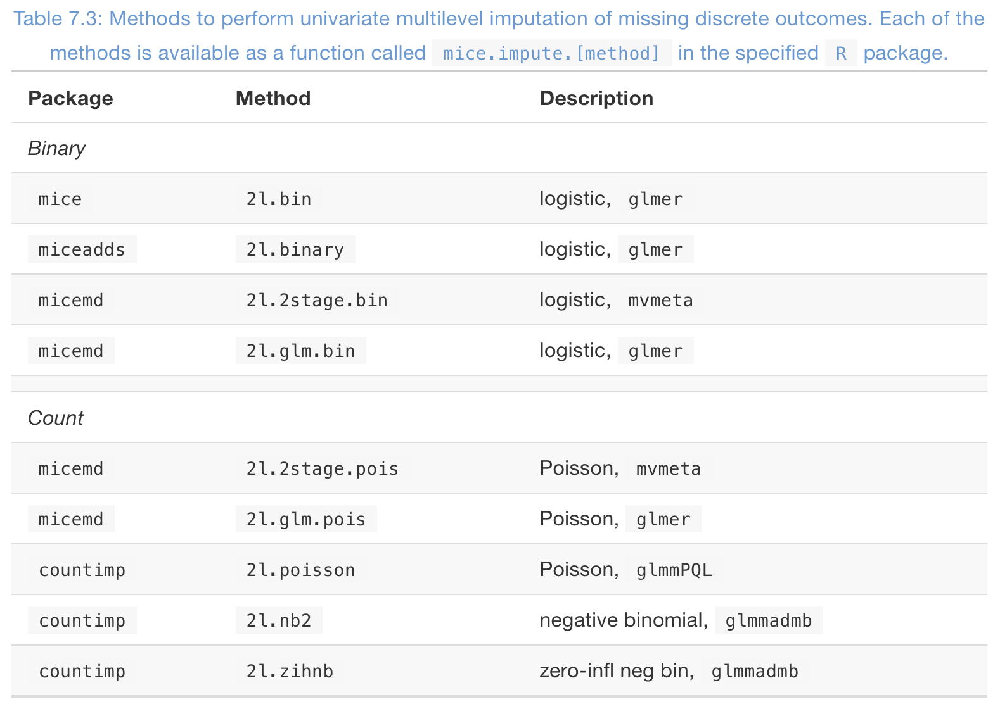

## Methods for multilevel imputation in `mice`
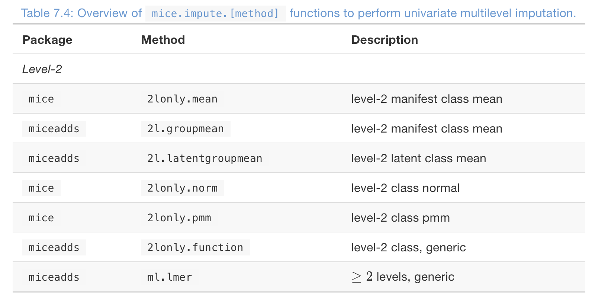

## In practice: start simple, empty model

```{r echo=TRUE}
d <- brandsma[, c("sch", "lpo")]
pred <- make.predictorMatrix(d)
pred["lpo", "sch"] <- -2
imp <- mice(d, pred = pred, meth = "2l.pmm", m = 10, 
            maxit = 1, print = FALSE, seed = 152)
```

## Analysis

```{r, echo=TRUE}
library(lme4)
fit <- with(imp, lmer(lpo ~ (1 | sch), REML = FALSE))
summary(pool(fit))
```

## Variance components

```{r, echo=TRUE}
library(mitml)
testEstimates(as.mitml.result(fit), var.comp = TRUE)$var.comp
```

## Now start adding model terms

<https://stefvanbuuren.name/fimd/sec-mlguidelines.html>

## Recipe: Missing level-1

     Recipe for a level-1 target
---- ---------------------------------------------------------------
1.   Define the most general analytic model to be applied to imputed data
2.   Select a `2l` method that imputes close to the data
3.   Include all level-1 variables
4.   Include the disaggregated cluster means of all level-1 variables
5.   Include all level-1 interactions implied by the analytic model
6.   Include all level-2 predictors
7.   Include all level-2 interactions implied by the analytic model
8.   Include all cross-level interactions implied by the analytic model
9.   Include predictors related to the missingness and the target
10.  Exclude any terms involving the target

## Uncollected variables: conclusion

- No need restrict analysis to least common denominator
- Impute systematically missing data with multilevel imputation model
  - Either 2-stage or generalized multilevel
- Technically still challenging, but doable (in `Stata` or `R`)
- More detail: <https://stefvanbuuren.name/fimd/ch-multilevel.html>

## Wrap up

1. Different number of categories
2. Uncollected variables

- I believe multiple imputation provides substantial progress over 
  - ad-hoc recoding strategies
  - restriction to observed data
- Of course, we always need MAR assumptions, but these are often natural for combined data
- Still experimental, more experience is needed 
- Long-term vision: data-combination as a **information translation service** for distributed data

